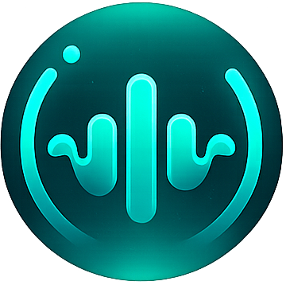

<div align="center">



# SyncBeat

Real-time synchronized music listening app built with React Native and Expo.

Listen together. Stay connected.

</div>

---

## Features

- Real-time synchronized music playback
- Room-based listening experience
- Stable Socket.IO connection
- Authentication system
- Social login support
- Modern music player UI
- Cross-platform support

---

## Tech Stack

- React Native
- Expo
- TypeScript
- Socket.IO
- Node.js
- Express

---

## Getting Started

### Install dependencies

```bash
npm install
```

### Start development server

```bash
npx expo start
```

---

## Project Structure

```bash
app/           # Application screens
components/    # Reusable UI components
hooks/         # Custom hooks
assets/        # Images, fonts, icons
constants/     # Static constants
```

---

## Future Plans

- Playlist synchronization
- Voice chat
- Spotify/YouTube integration
- Shared queue system
- Friend activity

---

## Author

Built by Ajoy Das

GitHub: https://github.com/Codewithajoydas